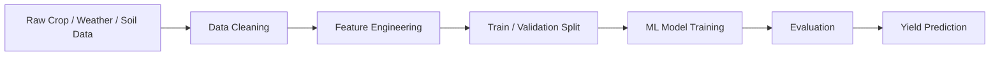

# Crop Yield Prediction

Machine-learning project for predicting agricultural crop yield from environmental and agronomic features.

## Why this project matters

Crop yield forecasting helps farmers, researchers, and policy teams estimate production earlier, compare growing conditions, and make better planning decisions. This repository demonstrates an applied ML workflow for tabular prediction in an agriculture context.

## Key Features

- Data preprocessing for agricultural features
- Exploratory data analysis workflow
- Supervised machine-learning model training
- Yield prediction pipeline
- Reproducible project structure for experimentation

## Architecture



## Tech Stack

- Python
- pandas / NumPy
- scikit-learn
- Matplotlib / visualization tools
- Jupyter Notebook workflow

## Suggested Screenshots

Add images to `docs/screenshots/` and reference them here:

```md


```

Recommended screenshots:

1. Dataset overview or EDA chart
2. Feature importance chart
3. Prediction/evaluation result table
4. Model performance comparison

## How to Run

```bash
git clone https://github.com/omerjadoon/crop-yield-prediction.git
cd crop-yield-prediction
pip install -r requirements.txt
```

Then run the notebooks or scripts in the repository.

## Evaluation Ideas

Track and report:

- MAE
- RMSE
- R² score
- Feature importance
- Train/test split strategy

## Future Improvements

- Add weather API integration
- Add geospatial features
- Add model comparison across Random Forest, XGBoost, and neural networks
- Add a lightweight FastAPI endpoint for inference
- Add Docker support

## Author

**Omer Khan Jadoon**  
AI & Machine Learning Engineer  
[LinkedIn](https://www.linkedin.com/in/omerkhanjadoon) • [GitHub](https://github.com/omerjadoon)
